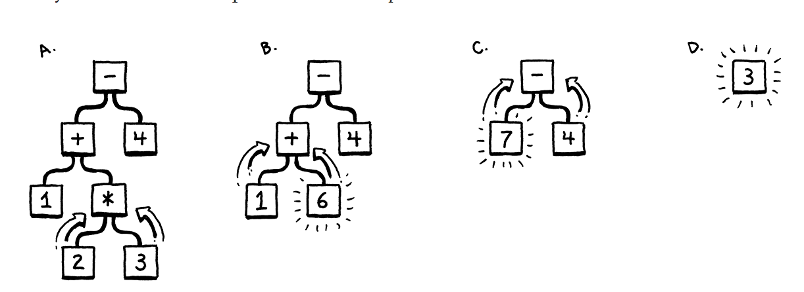
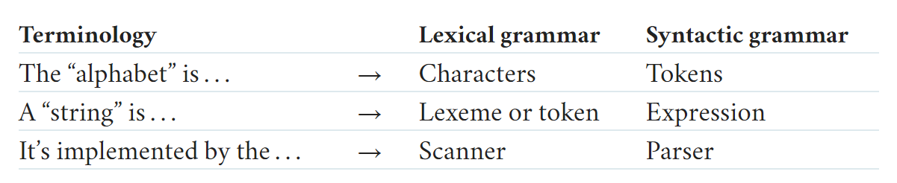
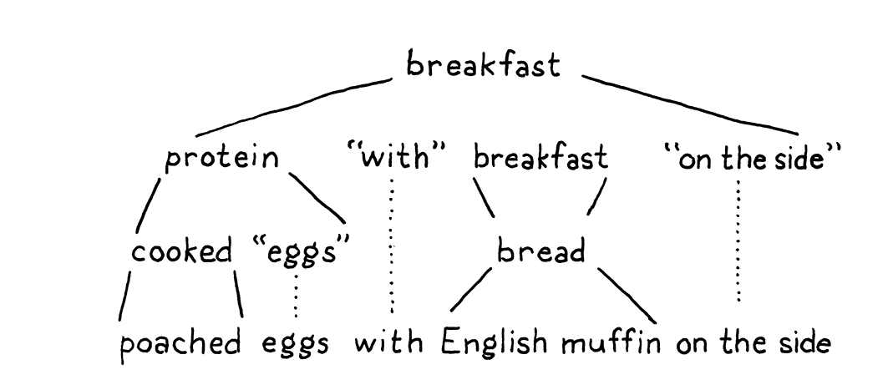

# jlox

Learning how to implement an interpreter🔨 from scratch.

There are several parts in Jlox, I don't know how to write the makefile to run Java project right
now, so I use *Android Studio*.

When running the scan section code, the interpreter can recognize certain characters. Like `!`, `(`
etc.

Just like the following: 
```shell
> 
+ - * !
PLUS + null
MINUS - null
STAR * null
BANG ! null
EOF  null
> 
can you do this () ? int main() { println() };
IDENTIFIER can null
IDENTIFIER you null
IDENTIFIER do null
THIS this null
LEFT_PAREN ( null
RIGHT_PAREN ) null
IDENTIFIER int null
IDENTIFIER main null
LEFT_PAREN ( null
RIGHT_PAREN ) null
LEFT_BRACE { null
IDENTIFIER println null
LEFT_PAREN ( null
RIGHT_PAREN ) null
RIGHT_BRACE } null
SEMICOLON ; null
EOF  null
```

## Representing Code

Before we do all that, let's focus on the main goal - a representation for code. It should be simple
for the parser to produce and easy for the interpreter to consume.
`1 + 2 * 3 - 4`, you know the multiplication is evaluated before the addition or subtraction. One 
way to visualize that precedence is using a tree. Leaf nodes are numbers, and interior nodes are 
operators with the branches for each of their operands.

In order to evaluate an arithmetic node, you need to know the numeric values of its subtrees, so you
have to evaluate those first. That means working your way from the leaves up to the root - *post-order*
traversal:

1. Starting with the full tree, evaluate the bottom-most operation, 2 * 3
2. Now we can evaluate the +
3. Next, the -
4. The final answer.

We need to get more precise about what that grammar is then. Like lexical grammars in the last chap.
, there is a long ton of theory around syntactic grammars. We start by moving one level up the 
[Chomsky hierarchy](https://en.wikipedia.org/wiki/Chomsky_hierarchy)...

### Context-Free Grammars

In the last chapter, the formalism we used for defining the lexical grammar - the rules for how 
characters get grouped into tokens - was called a *regular language*. Which is fine with our scanner
, but not powerful enough to handle expressions which can nest arbitrarily deeply.

We need a bigger hammer - **context-free grammar (CFG)**. It's the next heaviest tool in the toolbox
of [formal grammars](https://en.wikipedia.org/wiki/Formal_grammar).



### *Rules for grammars*

If you start with the rules, you can use them to *generate* strings that are in the grammar. Strings
created this way are called **derivations** because each is *derived* from the rules of the grammar.
In each step of the game, you pick a rule and follow what it tells you to do. Most of the lingo 
around formal grammars comes from playing them in this direction. Rules are called **productions**
because they *produce* strings in the grammar.

Each production in a context-free grammar has a **head** - its name -- and a **body**, which describes
what it generates. In its pure form, the body is simply a list of symbols. Symbols come in two 
delectable flavors:

* A **terminal** is a letter from the grammar's alphabet. You can think of it like a literal value.
In the syntactic grammar we're defining, the terminals are individual lexemes - tokens coming from
scanner like *if* or *1234*.
* A **nonterminal** is a named reference to another rule in the grammar. It means "play that rule 
and insert whatever it produces here". In this way, grammar composes.

To make this concrete, we need a way to write down these production rules. People have been trying 
to crystallize grammar all the way back to Panini's *Ashtadhyayi*, which codified Sanskrit grammar a
mere couple thousand years ago. Not much progress happened until John Backus and company needed a 
notation for specifying ALGOL 58 and came up with [Backus-Naur form](https://en.wikipedia.org/wiki/Backus–Naur_form)
(**BNF**). Since then, nearly everyone uses some flavor of BNF, tweaked to their own tastes.

**Something clean**, each rule is a name, followed by an arrow (->), followed by a sequence of 
symbols, and finally ending with a semicolon(;). Terminals are quoted strings, and nonterminals are 
lowercase words.

Here is a grammar for breakfast menus:
```shell
breakfast  -> protein "with" breakfast "on the side" ;
breakfast  -> protein ;
breakfast  -> bread ;

protein    -> crispiness "crispy" "bacon" ;
protein    -> "sausage" ;
protein    -> cooked "eggs" ;

crispiness -> "really" ;
crispiness -> "really" crispiness ;

cooked     -> "scrambled" ;
cooked     -> "poached" ;
cooked     -> "fried" ;

bread      -> "toast" ;
bread      -> "biscuits" ;
bread      -> "English muffin" ;
```

We can use this grammar to generate random breakfasts. Let's play a round and see how it works.

With that, every nonterminal in the string has been expanded until it finally contains only terminals
and we're left with:


### *Enhancing our notation*

## Parsing Expressions

The cover of _Compilers: Principles, Techniques, and Tools_ literally has a dragon labeled "complexity
of compiler design" being slain by a knight bearing a sword and shield branched "LAIR parser generator"
and "syntax directed translation". They laid it on thick.

A little self-congratulation is well-deserved, but the truth is you don't need to know most of that
stuff to bang out a high quality parser for a modern machine. As always, I encourage you to broaden your
education and take it in later, but this book omits the trophy case.

## Evaluating Expressions

Lox doesn't do implicit conversions in equality and Java does not either. We do have to handle `nil/null`
specially so that we don't throw a `NullPointerException` if we try to call `equals()` on `null`. Otherwise,
we're fine. Java's `equals()` method on Boolean, Double, and String have the behavior we want for Lox.

What do you expect this to evaluate to:
```
(0 / 0) == (0 / 0)
```
According to [IEEE 754](https://en.wikipedia.org/wiki/IEEE_754), which specifies the behaviors of
double-precision numbers, dividing a zero by zero gives you the special **NaN** ("not a number") value.
Strangely enough, NaN is *not* equal to itself.

In Java, the `==` operator on primitive doubles preserves that behavior, but the `equals()` method on the
Double class does not. Lox uses the latter, so doesn't follow IEEE. These kinds of subtle incompatibilities
occupy a dismaying fraction of language implementers' lives.

We could simply not detect or report a type error at all. This is what C does if you cast a pointer to some
type that doesn't match the data that is actually being pointed to. C gains flexibility and speed by
allowing that, but is also famously dangerous. Once you misinterpret bits in memory, all bets are off.

Few modern languages accept unsafe operations like that. Instead, most are **memory safe** and ensure - through
a combination of static and runtime checks - that a program can never incorrectly interpret the value stored
in a piece of memory.

### *Executing statements*

We're running through the previous couple of chapter in microcosm, working our way through the front end. Our
parser can now produce statement syntax trees, so the next and final step is to interpret them. As in
expressions, we use the **Visitor** pattern, but we have a new visitor interface, `Stmt.Visitor`, to implement
since statements have their own base class.

By the way, from the `Interpreter.java` file.

The class is default `PROTECTED` in java.