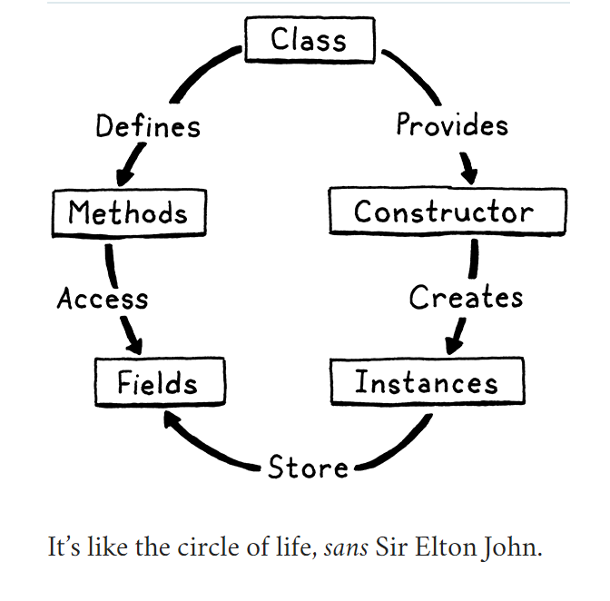

# Classes

## OOP and Classes

There are three broad paths to object-oriented programming: classes, prototypes, and multimethods. Classes came first
and are the most popular style. With the rise of JavaScript (and to a lesser extent Lua), prototypes are more widely 
known than they used to be.

The main goal of object orientation is to bundle data with the code that acts on it. Users do that by declaring a 
`class` that:
1. Exposes a *constructor* to create and initialize new *instance* of the class
2. Provides a way to store and access *fields* on instances
3. Define a set of *methods* shared by all instances of the class that operate on each instance's state.



## Class Declarations

Like we do, we're gonna start with syntax. A `class` statement introduces a new name, so it lives in the `declaration` 
grammar rule.
```shell
declaration     -> classDecl
                 | funDecl
                 | varDecl
                 | statement ;
                 
classDecl       -> "class" IDENTIFIER "{" function "}" ;                
```
The new `classDecl` rule relies on the `function` rule we defined earlier.
```shell
function        -> IDENTIFIER "(" parameters? ")" block ;
parameters      -> IDENTIFIER ( "," IDENTIFIER )* ;
```

In plain English, a class definition is the `class` keyword, followed by the class's name, then a curly-braced body. 
Inside that body is a list of method declarations. Unlike function declarations, methods don't have a leading `fun` 
keyword. Each method is a name, parameter list, and body. E.g.:
```shell
class Breakfast {
  cook() {
    print "Egg a-fryin'!";
  }
  
  serve(who) {
    print "Enjoy your breakfast, " + who + ".";
  }
}
```
Like most dynamic typed languages, fields are not explicitly listed in the class declaration. Instances are loose bags
of data and you can freely add fields to them as you see fit using normal imperative code.