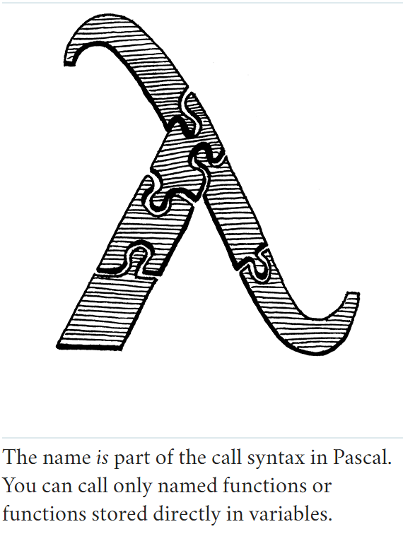

# Functions

> And that is also the way the human mind works - by the compounding of old ideas into new structures that become new
> ideas that can themselves be used in compounds, and round and round endlessly, growing ever more remote from the basic
> earthbound imagery that is each language's soil.  
> -- Douglas R. Hofstadter, I Am a Strange Loop

## Function Calls

You're certainly familiar with C-style function call syntax, but the grammar is more subtle than you may realize. Calls
are typically to named functions like:
```shell
average(1, 2);
```

But the name of the function being called isn't actually part of the call syntax. The thing being called-the **callee**-
can be any expression that evaluates to a function. (Well, it does have to be a pretty *high precedence* expression, but
parentheses take care of that.) E.g.:
```shell
getCallback()();
```
There are two call expressions here. The first pair of parentheses has `getCallback` as its callee. But the second call
has the entire `getCallback()` expression as its callee. It is the parentheses following an expression that indicate a
function call. You can think of a call as sort of like a postfix operator that starts with `(`.

> [More **callee** and **caller** explained](https://cs61.seas.harvard.edu/site/2018/Asm2/)

This "operator" has higher precedence than any other operator, even the unary ones. So we slot it into the grammar by 
having the `unary` rule bubble up to a new `call` rule.
```shell
unary               -> ( "!" | "-" ) unary | call ;
call                -> primary ( "(" arguments? ")" )* ;
```
This rule matches a primary expression followed by zero or more function calls. If there are no parentheses, this parses
a bare primary expression. Otherwise, each call is recognized by a pair of parentheses with an optional list of arguments
inside. The argument list grammar is:
```shell
arguments            -> expression ( "," expression )* ;
```
This rule requires at least one argument expression, followed by zero or more other expressions, each preceded by a 
comma. To handle zero-argument calls, the `call` rule itself considers the entire `arguments` production to be optional.

### *Maximum argument counts*

Right now, the loop where we parse arguments has no bound. If you want to call a function and pass a million arguments 
to it, the parser would have no problem with it. Do we want to limit that?

Other languages have various approaches. The C standard says a conforming implementation has to support *at least* 127 
arguments to a function, but doesn't say there's any upper limit. The Java specification says a method can accept *no
more than* 255 arguments.

> The limit is 254 arguments if the method is an instance method. That's because `this` - the receiver of the method - 
> works like an argument that is implicitly passed to the method, so it claims one of the slots.

### *Interpreting function calls*

### *Call type errors*

Before we get to implementing LoxCallable, we need to make the visit method a little more robust. It currently ignores 
a couple of failure modes that we can't pretend won't occur. First, what happens if the callee isn't actually something
you can call? What if you try to do this:
```shell
"totally not a function"();
```
Strings aren't callable in Lox. The runtime representation of a Lox string is a Java string, so when we cast that to 
LoxCallable, the JVM will throw a ClassCastException. We don't want our interpreter to vomit out some nasty Java stack 
trace and die. Instead, we need to check the type ourselves first.

### *Checking arity*

The other problem relates to the function's **arity**. Arity is the fancy term for the number of arguments a function
or operation expects. Unary operators have arity one, binary operators two, etc. With functions, the arity is determined
by the number of parameters it declares.
```shell
fun add(a, b, c) {
  print a + b + c;
}
```
This function defines three parameters, `a`, `b`, and `c`, so its arity is three and it expects three arguments. So what
if you try to call it like this:
```shell
add(1, 2, 3, 4);  // Too many
add(1, 2);  // Too few.
```
Different languages take different approaches to this problem. Of course, most statically typed languages check this at
compile time and refuse to compile the code if the argument count doesn't match the function's arity. JavaScript 
discards any extra arguments you pass. If you don't pass enough, it fills in the missing parameters with the magic 
sort-of-like-null-but-not-really value `undefined`. Python is stricter. It raises a runtime error if the argument list
is too short or too long.

## Native Functions

We can theoretically call functions, but we have no functions to call yet. Before we get to user-defined functions, now
is a good time to introduce a vital but ofter overlooked facet of language implementations-**native functions**.