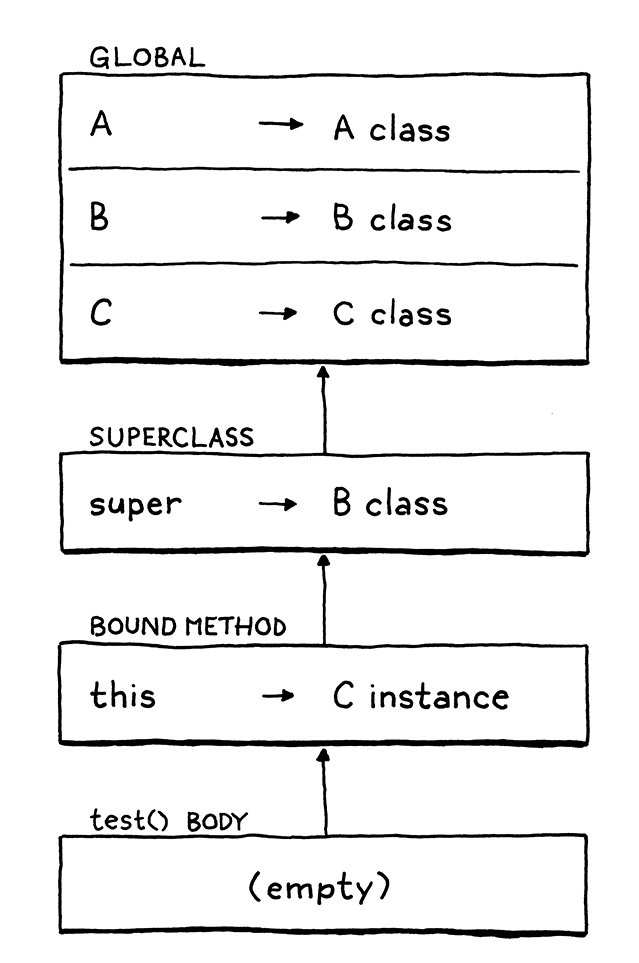

# Inheritance

## Superclasses and Subclasses

Way back when, C. A. R. Hoare coined the term "subclass" to refer to a record type that refines another type.
Simula borrowed that term to refer to a *class* that inherits from another. I don't think it was until Smalltalk came
along that someone flipped the Latin prefix to get "superclass" to refer to the other side of the relationship. From 
C++, you also hear "base" and "derived" classes. I'll mostly stick with "superclass" and "subclass".

> In set theory, a subset is contained by a larger superset which has all of the elements of the subset and possibly 
> more. Set theory and programming languages meet each other in type theory. There, you have "supertype" and "subtype".
> 
> In statically typed object-oriented languages, a subclass is also often a subtype of its superclass. Say we have a 
> Doughnut superclass and a BostonCream subclass. Every BostonCream is also an instance of Doughnut, but there may be
> doughnut objects that are not BostonCream (like Crullers).
> 
> Think of a type as the set of all values of that type. The set of all Doughnut instances contains the set of all 
> BostonCream  instances since every BostonCream is a subclass, and a subtype, and its instances are a subset. It all
> lines up.

Our first step towards supporting inheritance in Lox is a way to specify a superclass when declaring a class. There are 
a lot of varieties of syntax for this. C++ and C# place a `:` after the subclass's name, followed by the superclass 
name. Java uses `extends` instead of the colon. Python puts the superclass(es) in parentheses after the class name.
Simula puts the superclass's name *before* the `class` keyword.

This late in the game, I'd rather not add a new reserved word or token to the lexer. We don't have `extends` or even `:`
, so we'll follow Ruby and use a less-than sign (<).
```shell
class Doughnut {
  // General doughnut stuff...
}
class BostonCream < Doughnut {
  // Boston Cream-specific stuff...
}
```
To work this into the grammar, we add a new optional clause in our existing `classDecl` rule.
```shell
classDecl      -> "class" IDENTIFIER ( "<" IDENTIFIER )?
                  "{" function* "}" ;
```
After the class name, you can have a `<` followed by the superclass's name. The superclass clause is optional because
you don't *have* to have a superclass. Unlike some other object-oriented languages like Java, Lox has no root "Object"
class that everything inherits from, so when you omit the superclass clause, the class has *no* superclass, not even an
implicit one.


Because even well-intentioned programmers sometimes write weird code, there's a silly edge case we need to worry about 
while we're in here. Take a look at this:
```shell
class Oops < Oops {}
```
There's no way this will do anything useful, and if we let the runtime to run this, it will break the expectation the
interpreter has about there not being cycles in the inheritance chain. The safest thing is to detect this case 
statically and report it as an error.


If the class has a superclass expression, we evaluate it. Since that could potentially evaluate to some other kind of 
object, we have to check at runtime that the thing we want to be the superclass is actually a class. Bad things would 
happen if we allow code like:
```shell
var NotAClass = "I am totally not a class";
class Subclass < NotAClass {} // ?!
```


## Inheriting Methods

Inheriting from another class means that everything that's true of the superclass should be true, more or less, of the 
subclass. In statically typed languages, that carries a lot of implications. The sub*class* must also be a sub*type*, 
and the memory layout is controlled so that you can pass an instance of a subclass to a function expecting a superclass
and it can still access the inherited fields correctly.

Lox is a dynamically typed language, so our requirements are much simpler. Basically, it means that if you call some 
method on an instance of the superclass, you should be able to call that method when given an instance of the subclass.
In other words, methods are inherited from the superclass.

## Calling Superclass Methods

In `findMethod()` we look for a method on the current class *before* walking up the superclass chain. If a method with
the same name exists in both the subclass and the superclass, the subclass one takes precedence or **overrides** the 
superclass method. Sort of like how variables in inner scopes shadow outer ones.

That's great if the subclass wants to *replace* some superclass behavior completely. But, in practice, subclasses often
want to *refine* the superclass's behavior. They want to do a little work specific to the subclass, but also execute the
original superclass behavior too.

However, since the subclass has overridden the method, there's no way to refer to the original one. If the subclass 
method tries to call it by name, it will just recursively hit its own override. We need a way to say "Call this method,
but look for it directly on my superclass and ignore my override". Java uses `super` for this, and we'll use that same
syntax in Lox. E.g.:
```shell
class Doughnut {
  cook() {
    print "Fry until golden brown";
  }
}
class BostonCream < Doughnut {
  cook() {
    super.cook();
    print "Pipe full of custard and coat with chocolate.";
  }
}
```
If you run this, is should print:
```shell
Fry until golden brown
Pipe full of custard and coat with chocolate.
```

### *Syntax*

With `this`, the keyword works sort of like a magic variable, and the expression is that one lone taken. But with 
`super`, the subsequent `.` and property name is inseparable parts of the `super` expression. You can't have a bare 
`super` token all by itself.
```shell
print super;  // should cause Syntax error.
```
So the new clause we add to the `primary` rule in our grammar includes the property access as well.
```shell
primary     -> "true" | "false" | "nil" | "this"
             | NUMBER | STRING | IDENTIFIER | "(" expression ")"
             | "super" "." IDENTIFIER ;
```
Typically, a `super` expression is used for a method call, but, as with regular methods, the argument list is *not* part
of the expression. Instead, a super *call* is a super *access* followed by a function call. Like other method calls, you
can get a handle to a superclass method and invoke it separately.
```shell
var method = super.cook;
method();
```

### *Semantics*

Earlier, I said a `super` expression starts the method lookup from "the superclass", but *which* superclass? The naive 
answer is the superclass of `this`, the object the surrounding method was called on. That coincidentally produces the 
right behavior in a lot of cases, but that's not actually correct. Gaze upon:
```shell
class A {
  method() {
    print "A method";
  }
}

class B < A {
  method() {
    print "B method";
  }
  test() {
    super.method();
  }
}

class C < B {}

C().test();
```
Translate this program to Java, C#, or C++ and it will print "A method", which is what we want Lox to do too. When this
program runs, inside the body of `test()`, `this` is an instance of C. The superclass of C is B, but that is *not* where
the lookup should start. If it did, we should hit B's `method()`.

Instead, lookup should start on the superclass of *the class containing the* `super` *expression*. In this case, since
`test()` is defined inside B, the `super` expression inside it should start the lookup on B's superclass - A.

> The execution flow looks something like this:
> 1. We call `test()` on an instance of C.
> 2. That enters the `test()` method inherited from B. That calls `super.method()`.
> 3. The superclass of B is A, so that chains to `method()` on A, and the program prints "A method".

Thus, in order to evaluate a `super` expression, we need access to the superclass of the class definition surrounding 
the call. Alack and alas, at the point in the interpreter where we are executing a `super` expression, we don't have 
that easily available.

We *could* add a field to LoxFunction to store a reference to the LoxClass that owns that method. The interpreter would 
keep a reference to the currently executing LoxFunction so that we could look it up later when we hit a `super` 
expression. From there, we'd get the LoxClass of the method, then its superclass.

One important difference is that we bound `this` when the method was *accessed*. The same method can be called on 
different instances and each needs its own `this`. With `super` expressions, the superclass is a fixed property of the
*class declaration itself*. Every time you evaluate some `super` expression, the superclass is always the same.

That means we can create the environment for the superclass once, when the class definition is executed. Immediately 
before we define the methods, we make a new environment to bind the class's superclass to the name `super`.

When we create the LoxFunction runtime representation for each method, that is the environment they will capture in 
their closure. Later, when a method is invoked and `this` is bound, the superclass environment becomes the parent for 
the method's environment, like so:

That's a lot of machinery, but we'll get through it a step at a time. Before we can get to creating the environment at 
runtime, we need to handle the corresponding scope chain in the resolver.