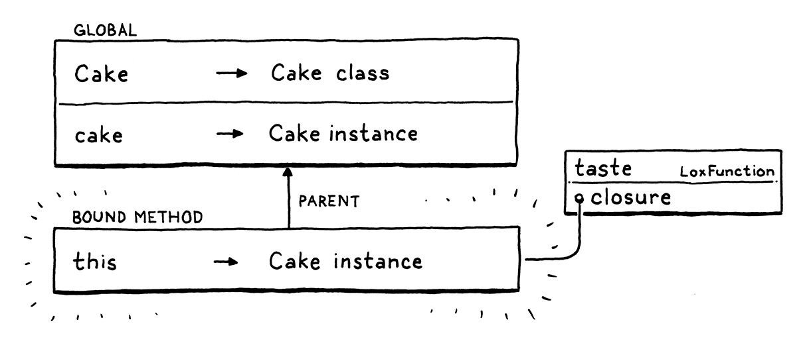

# Classes

## OOP and Classes

There are three broad paths to object-oriented programming: classes, prototypes, and multimethods. Classes came first
and are the most popular style. With the rise of JavaScript (and to a lesser extent Lua), prototypes are more widely 
known than they used to be.

The main goal of object orientation is to bundle data with the code that acts on it. Users do that by declaring a 
`class` that:
1. Exposes a *constructor* to create and initialize new *instance* of the class
2. Provides a way to store and access *fields* on instances
3. Define a set of *methods* shared by all instances of the class that operate on each instance's state.


## Class Declarations

Like we do, we're gonna start with syntax. A `class` statement introduces a new name, so it lives in the `declaration` 
grammar rule.
```shell
declaration     -> classDecl
                 | funDecl
                 | varDecl
                 | statement ;
                 
classDecl       -> "class" IDENTIFIER "{" function "}" ;                
```
The new `classDecl` rule relies on the `function` rule we defined earlier.
```shell
function        -> IDENTIFIER "(" parameters? ")" block ;
parameters      -> IDENTIFIER ( "," IDENTIFIER )* ;
```

In plain English, a class definition is the `class` keyword, followed by the class's name, then a curly-braced body. 
Inside that body is a list of method declarations. Unlike function declarations, methods don't have a leading `fun` 
keyword. Each method is a name, parameter list, and body. E.g.:
```shell
class Breakfast {
  cook() {
    print "Egg a-fryin'!";
  }
  
  serve(who) {
    print "Enjoy your breakfast, " + who + ".";
  }
}
```
Like most dynamic typed languages, fields are not explicitly listed in the class declaration. Instances are loose bags
of data, and you can freely add fields to them as you see fit using normal imperative code.

## Creating Instances

We have classes, but they don't do anything yet. Lox doesn't have "static" methods that you can call right on the class
itself, so w/o actual instances, classes are useless. Thus, instances are the next step.

While some syntax and semantics are fairly standard across OOP languages, the way you create new instances isn't. Ruby,
following Smalltalk, creates instances by calling a method on the class object itself, a recursively graceful approach.
Some, like C++ and Java, have a `new` keyword dedicated to birthing a new object. Python has you "call" the class itself
like a function. (JavaScript, ever weird, sort of does both.)

I took a minimal approach with Lox. We already have class objects, and we already have function calls, so we'll use call
expressions on class objects to create new instances. It's as if a class is a factory function that generates instances
of itself. This feels elegant to me, and also spares us the need to introduce syntax like `new`. Therefore, we can skip
past the front end straight into the runtime.

## Properties on Instances

After creating the instances, we should make them useful. We're at a fork in the road. We could add behavior first -
mothods - or we could start with state - properties. We're going to take the latter because, as we can see, the two get
entangled in an interesting way and it will be easier to make sense of them if we get properties working first.

Lox follows JavaScript and Python in how it handles state. Every instance is an open collection of named values. Methods
on the instance's class can access and modify properties, but so can outside code. Properties are accessed using a `.` 
syntax.
```shell
someObject.someProperty
```
An expression followed by `.` and an identifier reads the property with that name from the object the expression 
evaluates to. That dot has the same precedence as the parentheses in a function call expression, so we slot it into the
grammar by replacing the existing `call` rule with:
```shell
call        -> primary ( "(" arguments? ")" | "." IDENTIFIER )* ;
```
After a primary expression, we allow a series of any mixture of parenthesized called and dotted property accesses. 
"Property access" is a mouthful, so from here on out, we'll call these "get expressions".

### *Get expressions*

The outer `while` loop there corresponds to the `*` in the grammar rule. We zip along the tokens building up a chain of
calls and gets as we find parentheses and dots, like so:


### *Set expressions*

Setters use the same syntax as getters, except they appear on the left side of an assignment.
```shell
someObject.someProperty = value;
```
In grammar land, we extend the rule for assignment to allow dotted identifiers on the left-hand side.
```shell
assignment      -> ( call ".")? IDENTIFIER "=" assignment
                 | logic_or ;
```
Unlike getters, setters don't chain. However, the reference to `call` allows any high-precedence expression before the
last dot, including any number of *getters*, as in:

Note here that only the *last* part, the `.meat` is the *setter*. The `.omelette` and `.filling` parts are both *get*
expressions.

## Methods on Classes

You can create instances of classes and stuff data into them, but the class itself doesn't really *do* anything.
Instances are just maps and all instances are more or less the same. To make them feel like instancs *of classes*, we 
need behavior - methods.

Our helpful parser already parses method declaration, so we're good there. We also don't need to add any new parser 
support for method *calls*. We already have `.` (getters) and `()` (function calls). A "method call" simply chains those
together.

That raises an interesting question. What happens when those two expressions are pulled apart? Assuming that `method` in
this example is a method on the class of `object` and not a field on the instance, what should the following piece of 
code do?
```shell
var m = object.method;
m(argument);
```
This program "looks up" the method and stores the result - whatever that is - in a variable and then calls that object
later. Is this allowed? Can you treat a method like it's a function on the instance?

What about the other direction?
```shell
class Box {}

fun notMethod(argument) {
  print "called function with " + argument;
}

var box = Box();
box.function = notMethod;
box.function("argument");
```
This program creates an instance and then stores a function in a field on it. Then is calls that function using the same
syntax as a method call. Does that work?

Different languages have different answers to these questions. One could write a treatise on it. For Lox, we'll say the 
answer to both of these is yes, it does work. We have a couple of reasons to justify that. For the second example - 
calling a function stored in a field - we want to support that because first-class functions are useful and storing them
in fields is a perfectly normal thing to do.

The first example is more obscure. One motivation is that users generally expect to be able to hoist a subexpression out
into a local variable w/o changing the meaning of the program. You can take this:
```shell
breakfast(omelette.filledWith(cheese), sausage);
```
And turn it into this:
```shell
var eggs = omelette.filledWith(cheese);
breakfast(eggs, sausage);
```
And it does the same thing. Likewise, since the `.` and the `()` in a method call *are* two separate expressions, it 
seems you should be able to hoist the `lookup` part into a variable and then call it later.
> A motivating use for this is callbacks. Often, you want to pass a callback whose body simply invokes a method on some
> object. Being able to look up the method and pass it directly saves you the chore of manually declaring a function to
> wrap it. 
> ```shell
> fun callback(a, b, c) {
>   object.method(a, b, c); 
> }
> takeCallback(callback);
> ```
> ```shell
> takeCallback(object.method);
> ```

We need to think carefully about what the *thing* you get when you look up a method is, and how it behaves, even in 
weird cases like:
```shell
class Person {
  sayName() {
    print this.name;
  }
}

var jane = Person();
jane.name = "Jane";

var method = jane.sayName;
method();  // ?
```
If you grab a handle to a method on some instance and call it later, does it "remember" the instance it was pulled off
from? Does `this` inside the method still refer to that original object?

A more pathological example:
```shell
class Person {
  sayName() {
    print this.name;
  }
}

var jane = Person();
jane.name = "Jane";

var bill = Person();
bill.name = "Bill";

bill.sayName = jane.sayName;
bill.sayName(); // ?
```
Lox, though, has real class syntax so we do know which callable things are methods and which are functions. Thus, like 
Python, C#, and others, we will have methods "bind" `this` to the original instance when the method is first grabbed.
Python calls these **bound methods**.

🌟
In practice, that's usually what you want. If you take a reference to a method on some object so you can use it as a 
callback later, you want to remember the instance it belonged to, even if that callback happens to be stored in a field
on some other object.

## This

We can define both behavior and state on objects, but they aren't tied together yet. Inside a method, we have no way to
access the fields of the "current" object - the instance that the method was called on - nor can we call other methods
on that same object.

To get at that instance, it needs a name. Smalltalk, Ruby, and Swift use "self". Simula, C++, Java, and other use 
"this". Python uses "self" be convention, but you can technically it whatever you like.
> "I" would have been a great choice, but using "i" for loop variables predates OOP and goes all the way back to 
> Fortran. We are victims of the incidental choices of our forebears.

For Lox, since we generally hew to Java-ish style, we'll go with "this". Inside a method body, a `this` expression 
evaluates to the instance that the method was called on. Or, more specifically, since methods are accessed and then 
invoked as two steps, it will refer to the object that the method was *accessed* from.

That makes our job harder. Peep at:
```shell
class Egotist {
  speak() {
    print this;
  }
}
var method = Egotist().speak;
method();
```
On the second-to-last line, we grab a reference to the `speak()` method off an instance of the class. That returns a 
function, and that function needs to remember the instance it was pulled off of so that *later*, on the last line, it 
can still find it when the function is called.

We need to take `this` at the point that the method is accessed and attach it to the function somehow so that it stays
around as long as we need it to. Hmm... a way to store some extra data that hangs around a function. eh? That sounds an 
awful lot like a *closure*, doesn't it?

If we defined `this` as a sort of hidden variable in an environment that surrounds the function returned when looking 
up a method, then uses of `this` in the body would be able to find it later. LoxFunction already has the ability to hold
on to a surrounding environment, so we have the machinery we need.

E.g.: 
```shell
class Cake {
  taste() {
    var adjective = "delicious";
    print "The " + this.flavor + " cake is " + adjective + "!";
  }
}
var cake = Cake();
cake.flavor = "German chocolate";
cake.taste();  // Prints "The German chocolate cake is delicious!".
```
When we first evaluate the class definition, we create a LoxFunction for `taste()`. Its closure is the environment
surrounding the class, in this case the global one. So the LoxFunction we store in the class's method map looks like so:

When we evaluate the `cake.taste` get expression, we create a new environment that binds `this` to the object the method
is accessed from (here, `cake`). Then we maek a *new* LoxFunction with the same code as the original one but using that 
new environment as its closure.

This is the LoxFunction that gets returned when evaluating the get expression for the method name. When that function is
later called by a `()` expression, we create an environment for the method body as usual.

The parent of the body environment is the environment we created earlier to bind `this` to the current object. Thus any
use of `this` inside the body successfully resolves to that instance.

Reusing our environment code for implementing `this` also takes care of interesting cases where methods and functions 
interact, like:
```shell
class Thing {
  getCallback() {
    fun localFunction() {
      print this;
    }
    
    return localFunction;
  }
}

var callback = Thing().getCallback();
callback();
```
In, say, JavaScript, it's common to return a callback from inside a method. That callback may want to hang on to and 
retain access to the original object - the `this` value - that the method was associated with. Our existing support for
closures and environment chains should do all this correctly.

### *Invalid uses of this*

Wait a minute. What happens if you try to use `this` *outside* of a method? What about:
```shell
print this;
```
Or: 
```shell
fun notAMethod() {
  print this;
}
```
There is no instance for `this` to point to if you're not in a method. We could give it some default value like `nil` or
make it a runtime error, but the user has clearly made a mistake. The sooner they find and fix that mistake, the happier
they'll be.

Our resolution pass is a fine place to detect this error statically. It already detects `return` statements outside of
functions. We'll do something similar for `this`. In the vein of our existing FunctionType enum, we define a new 
ClassType one.
