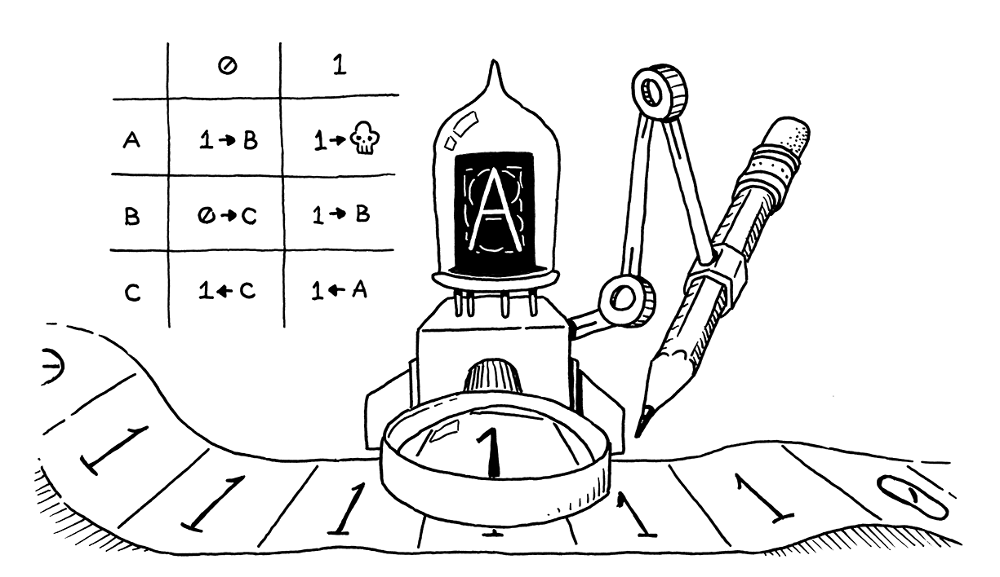
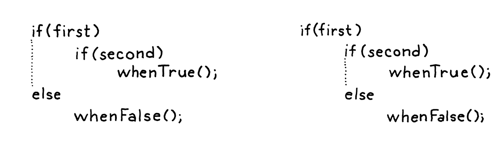

# Control Flow

> Logic, like whiskey, loses its beneficial effect when taken in too large quantities.
> -- Edward John Moreton Drax Plunkett, Lord Dunsany

Right now, our interpreter is little more than a calculator. A lox program can only do a fixed 
amount of work before completing. To make it run twice as long, you have to make the source code
twice as lengthy. We're about to fix that. In this chapter, our interpreter takes a big step 
towards the programming language major leagues: **Turning-completeness**.

## Turning Machines (Briefly)

In the early part of the last century, mathematicians stumbled into a series of confusing paradoxes
that led them to doubt the stability of the foundation they had built their work upon. To address 
that [crisis](https://en.wikipedia.org/wiki/Foundations_of_mathematics#Foundational_crisis), they 
went back to square one. Starting from a handful of axioms, logic, and set theory, they hoped to 
rebuild mathematics on top of an impervious foundation.

They wanted to rigorously answer questions like, "Can all true statements be proven?", "Can we 
[compute](https://en.wikipedia.org/wiki/Computable_function) all functions that we can define?", or
even the more general question, "What do we mean when we claim a function is 'computable'?"

They presumed the answer to the first two questions would be "yes." All that remained was to prove
it. It turns out that the answer to both is "no", and astonishingly, the two questions are deeply 
intertwined. This is a fascinating corner of mathematics that touches fundamental questions about 
what brains are able to do and how the universe works. I can't do it justice here.

What I do want to note is that in the process of proving that the answer to the first two question
is "no", Alan Turing and Alonzo Church devised a precise answer to the last question — a definition
of what kinds of functions are computable. They each crafted a tiny system with a minimum set of 
machinery that is still powerful enough to compute any of a (very) large class of functions.

These are now considered the "computable functions". Turning's system is called a **Turing Machine**.
Church's is the **lambda calculus**. Both are still widely used as the basis for models of computation
and, in fact, many modern functional programming languages use the lambda calculus at their core.


Turing machines have better name recognition - there's no Hollywood film about Alonzo Church yet - but 
the two formalisms are [equivalent in power](https://en.wikipedia.org/wiki/Church–Turing_thesis). In 
fact, any programming language with some minimal level of expressiveness is powerful enough to compute 
*any* computable function.

You can prove that by writing a simulator for a Turing machine in your language. Since Turing proved his
machine can compute any computable function, by extension, that means your language can too. All you 
need to do is translate the function into a Turning machine, and then run that on your simulator.

If your language is expressive enough to do that, it's considered **Turing-complete**. Turing machines 
are pretty dang simple, so it doesn't take much power to do this. You basically need arithmetic, a little
control flow, and the ability to allocate and use (theoretically) arbitrary amounts of memory. We've 
got the first.

## Conditional Execution

Enough history, let's jazz up our language. We can divide control flow roughly into two kinds:
* **Conditional** or **branching control flow** is used to *not* execute some piece of code. Imperatively,
    you can think of it as jumping *ahead* over a region of code.
* **Looping control flow** executes a chunk of code more than once. It jumps *back* so that you can do
    something again. Since you don't usually want *infinite* loops, it typically has some conditional 
    logic to know when to stop looping as well.

Branching is simpler, so we'll start there. C-derived languages have two main conditional execution features,
the `if` statement and the perspicaciously named "conditional" operator (`?:`). An `if` statement lets 
you conditionally execute statements, and the conditional operator lets you conditionally execute expressions.
> The conditional operator is also called the "Ternary" operator because it's the only operator in C that 
> takes three operators.

For simplicity's sake, Lox doesn't have a conditional operator, so let's get our `if` statement on. Our 
statement grammar gets a new production.
```shell
statement         -> exprStmt
                   | ifStmt
                   | printStmt
                   | block ;
                   
ifStmt            -> "if" "(" expression ")" statement
                   ( "else" statement )? ;
```
An `if` statement has an expression for the condition, then a statement to execute if the condition is truthy.
Optionally, it may also have an `else` keyword and a statement to execute if the condition is false. The syntax
tree node has fields for each of those three pieces.

As usual, the parsing code hews closely to the grammar. It detects an else clause by looking for the preceding 
`else` keyword. If there isn't one, the `elseBranch` field in the syntax tree is `null`.

That seemingly innocuous optional else has, in fact, opened up an ambiguity in our grammar. Consider:
```shell
if (first) if (second) whenTrue(); else whenFalse();
```

Here's the riddle: Which `if` statement does that else clause belong to? This isn't just a theoretical question about
how we notate our grammar. It actually affects how the code executes:

* If we attach the else to the first `if` statement, then `whenFalse()` is called if `first` is falsey, regardless of
    what value `second` has.
* If we attach it to the second `if` statement, then `whenFalse()` is only called if `first` is truthy and `second` is
    falsey.

Since else clauses are optional, and there is no explicit delimiter marking the end of the `if` statement, the grammar
is ambiguous when you nest `if`s in this way. This classic pitfall of syntax is called the [dangling else](https://en.wikipedia.org/wiki/Dangling_else)
problem.


It is possible to define a context-free grammar that avoids the ambiguity derectly, but it requires splitting most of 
the statement rules into pairs, one that allows an `if` with an `else` and one that donesn't. It's annoying.

## Solution for Dangling else

Instead, most languages and parsers avoid the problem in an ad hoc way. No matter what hack they use to get themselves
out of the trouble, they always choose the same interpretation - the `else` is bound to the nearest `if` that precedes 
it.

Our parser conveniently does that already. Since `ifStatement()` eagerly looks for an `else` before returning, the 
innermost call to a nested series will claim the else clause for itself before returning to the outer `if` statements.

## Logical Operators

Since we don't have the conditional operator, you might think we're done with branching, but no. Even without the 
ternary operator, there are two other operators that are technically control flow constructs - the logical operators
`and` and `or`.

These aren't like other binary operators because they **short-circuit**. If, after evaluating the left operand, we know
what the result of the logical expression must be, we don't evaluate the right operand. E.g.:
```shell
false and sideEffect();
```

For and `and` expression to evaluate to something truthy, both operands must be truthy. We can see as soon as we 
evaluate the left `false` operand that isn't going to be the case, so there's no need to evaluate `sideEffect()` and
it gets skipped.

This is why we didn't implement the logical operators with the other binary operators. Now we're ready. The two new 
operators are low in the precedence table. Similar to `||` and `&&` in C, they each have their own precedence with `or`
lower than `and`. We slot then right between `assignment` and `equality`.
```shell
expression          -> assignment ;
assignment          -> IDENTIFIER "=" assignment
                     | logic_or ;
logic_or            -> logic_and ( "or" logic_and )* ;
logic_and           -> equality ( "and" equality )* ;
```

Instead of falling back to `equality, assignment` now cascades to `logic_or`. The two new rules, `logic_or` and 
`logic_and`, are similar to other binary operators. Then `logic_and` calls out to `equality` for its operands, and we 
chain back to the rest of the expression rules.

The other interesting piece here is deciding what actual value to return. Since Lox is dynamically typed, we allow
operands of any type and use truthiness to determine what each operand represents. We apply similar reasoning to the 
result. Instead of promising to literally return `true` or `false`, a logic operator merely guarantees it will return 
a value with appropriate truthiness.

Fortunately, we have values with proper truthiness right at hand - the results of the operands themselves. So we use 
those. E.g.:
```shell
print "hi" or 2;  // "hi"
print nil or "yes";  // "yes"
```
On the first line, "hi" is truthy, so the `or` short-circuits and returns that. On the second line, `nil` is falsey, so 
it evaluates and returns the second operand, "`yes`".


## While Loops

Lox features two looping control flow statements, `while` and `for`. The `while` loop is the simpler one, so we'll start
there. Its grammar is the same as in C.
```shell
statement           -> exprStmt
                     | ifStmt
                     | printStmt
                     | whileStmt
                     | block ;
                     
whileStmt           -> "while" "(" expression ")" statement ;                  
```

## For Loops

We're down to the last control flow construct, Ye Olde C-style `for` loop.
```shell
for (var i = 0; i < 10; i = i + 1) print i;
```
In grammarese, that's:
```shell
statement         -> exprStmt
                   | forStmt
                   | ifStmt
                   | printStmt
                   | whileStmt
                   | block ;
                   
forStmt           -> "for" "(" ( varDecl | exprStmt | ";" )                   
                     expression? ";"
                     expression? ")" statement ;
```

Inside the parentheses, you have three clauses separated by semicolons:
1. The first clause is the *initializer*. It is executed exactly once, before anything else. It's usually an expression,
    but for convenience, we also allow a variable declaration. In that case, the variable is scoped to the rest of the
    `for` loop - the other two clauses and the body.
2. Next is the `condition`. As in a `while` loop, this expression controls when to exit the loop. It's evaluated once 
    at the begining of each iteration, including the first. If the result is truthy, it executes the loop body. 
    Otherwise, it bails.
3. The last clause is the *increment*. It's an arbitrary expression that does some work at the end of each loop 
    iteration. The result of the expression is discarded, so it must have a side effect to be useful. In practice, it
    usually increments a variable.

Any of these clauses can be omitted. Following the closing parenthesis is a statement for the body, which is typically
a block.

### 