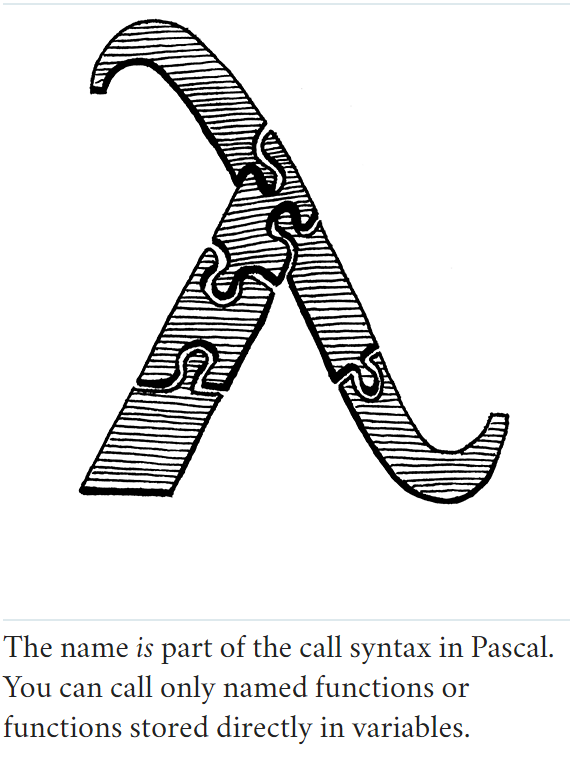

# Functions

> And that is also the way the human mind works - by the compounding of old ideas into new structures that become new
> ideas that can themselves be used in compounds, and round and round endlessly, growing ever more remote from the basic
> earthbound imagery that is each language's soil.  
> -- Douglas R. Hofstadter, I Am a Strange Loop

## Function Calls

You're certainly familiar with C-style function call syntax, but the grammar is more subtle than you may realize. Calls
are typically to named functions like:
```shell
average(1, 2);
```

But the name of the function being called isn't actually part of the call syntax. The thing being called-the **callee**-
can be any expression that evaluates to a function. (Well, it does have to be a pretty *high precedence* expression, but
parentheses take care of that.) E.g.:
```shell
getCallback()();
```
There are two call expressions here. The first pair of parentheses has `getCallback` as its callee. But the second call
has the entire `getCallback()` expression as its callee. It is the parentheses following an expression that indicate a
function call. You can think of a call as sort of like a postfix operator that starts with `(`.

This "operator" has higher precedence than any other operator, even the unary ones. So we slot it into the grammar by 
having the `unary` rule bubble up to a new `call` rule.
```shell
unary               -> ( "!" | "-" ) unary | call ;
call                -> primary ( "(" arguments? ")" )* ;
```
This rule matches a primary expression followed by zero or more function calls. If there are no parentheses, this parses
a bare primary expression. Otherwise, each call is recognized by a pair of parentheses with an optional list of arguments
inside. The argument list grammar is:
```shell
arguments            -> expression ( "," expression )* ;
```
This rule requires at least one argument expression, followed by zero or more other expressions, each preceded by a 
comma. To handle zero-argument calls, the `call` rule itself considers the entire `arguments` production to be optional.

